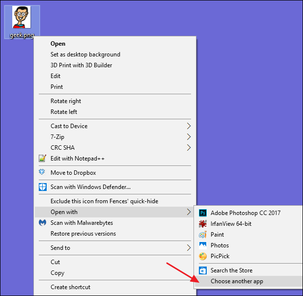
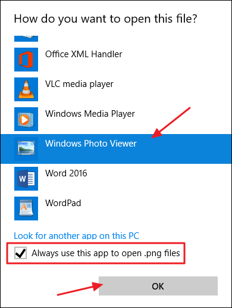

# Activate_Windows_Photo_Viewer_on_Windows10.reg

Windows Photo Viewer is not showing on your Windows 10 PC?

Windows 10 uses the new Photos app as your default image viewer, but many people still prefer the old Windows Photo Viewer. You can get Photo Viewer back in Windows 10, though. It’s just hidden.

If you upgrade a PC running Windows 7 or 8.1 to Windows 10, Windows Photo Viewer will be available and you can set it as your default photo viewer if you want. However, if you perform a clean installation of Windows 10—or buy a PC with Windows 10 already on it—you can’t access Photo Viewer at all. The interesting thing is that Photo Viewer is still there. It’s just hidden and you’ll have to make a couple of Registry edits to have it show up. After you do that, you can then set it as your default photo viewer.

For whatever reason, Microsoft opted not to include the Registry keys that enable access to Windows Photo Viewer on Windows 10. Those keys are kept in place if you upgrade from a previous version of Windows, but they aren’t created during the installation of Windows 10. Microsoft really wants you to open all those image files in its new Photos app, instead.

And remember this step is only necessary if you’re using a fresh Windows 10 system. 

## Usage
Run the "Activate_Windows_Photo_Viewer_on_Windows10.reg" file (Windows Registry file). 
It is used to add or change values in the Registry used for displaying Windows Photo Viewer.

If you want to deactivate this feature you just have to run "Deactivate_Windows_Photo_Viewer_on_Windows_10.reg".

If you want to make Windows Photo Viewer default viewer for your images follow steps provided in further images:

## Authors

* **Walter Glenn**

## Go back
[Thranduil77/scripts](https://github.com/Thranduil77/scripts)
